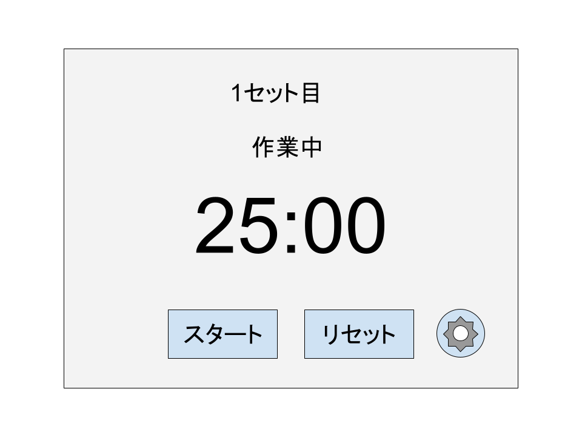
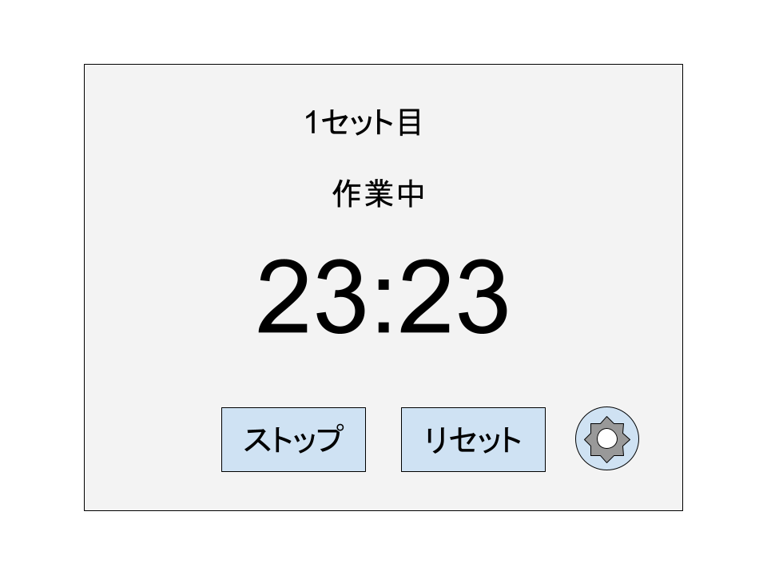
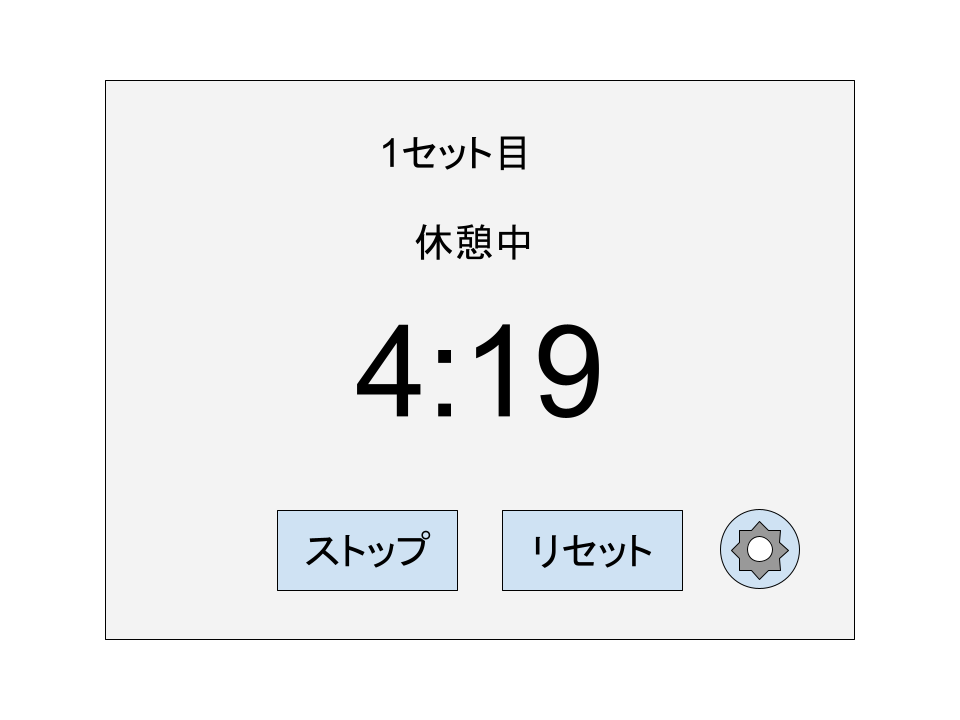
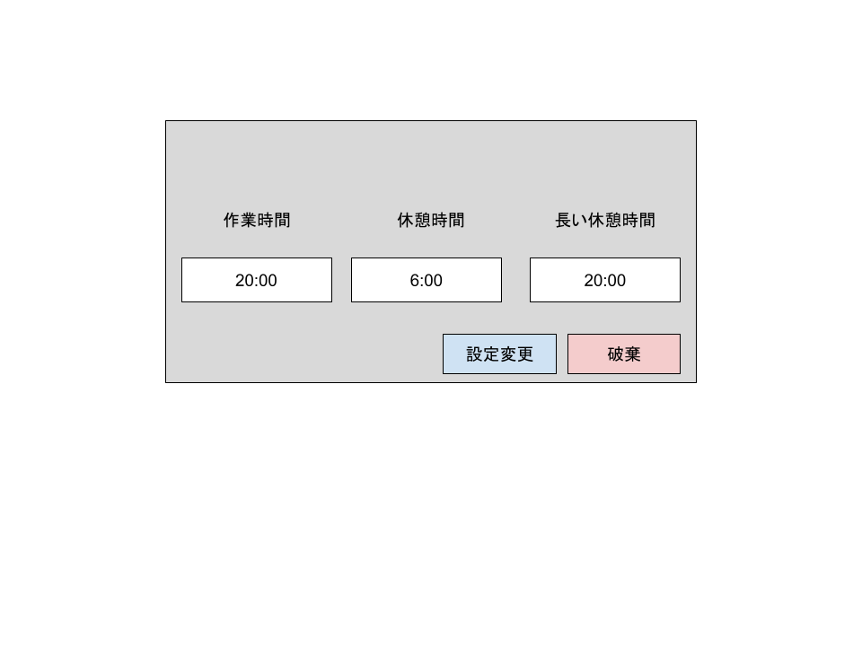

# pomodoro-timer

## ポモドーロタイマーについて
ポモドーロタイマーとはポモドーロテクニックを元にしたタイマーである。
ポモドーロテクニックとは時間管理術のことで25分間の作業と5分の休憩を繰り返し行うことである。
これの4セット目の休憩時間を長くし、また25分間の作業と5分の休憩を繰り返す。

## 初期状態

上部に何セット目か、画面中央に大きくカウントダウンタイマーがある。
下部にはスタートボタンとリセットボタン、設定ボタンが配置されている。

## 作業中

初期状態からスタートボタンを押すと作業中の状態になり、カウントダウンが始まる。
スタートの文字がストップに変わる。ここでストップを押すとタイマーが止まりボタンの文字がストップからスタートに変わる。
カウントダウンタイマーが0になると休憩中の状態に移行する。

## 休憩中

休憩時間のカウントダウンが始まる。
作業中と同じくストップボタンを押すとスタートに変わりカウントダウンが止まる。
4の倍数セット目のとき、かつそのときに限り長い休憩時間が設定される。

## 設定画面

右下の歯車を押すと設定ウィンドウが表示される。
ここでは作業時間と休憩時間、両方とも設定できる。
